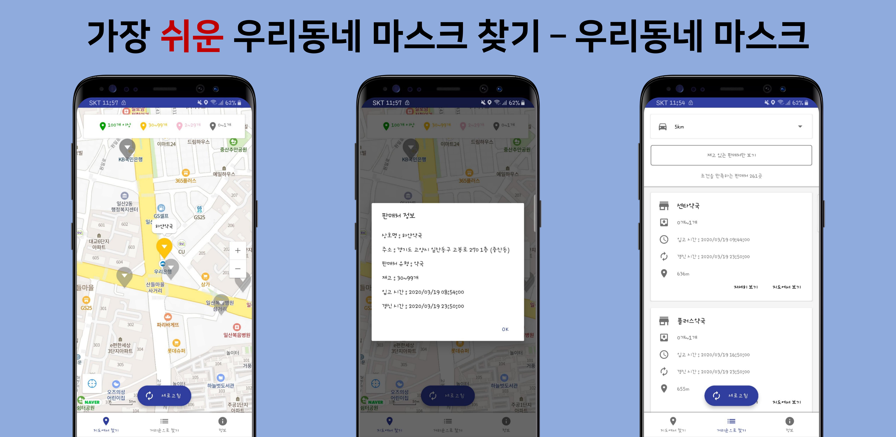
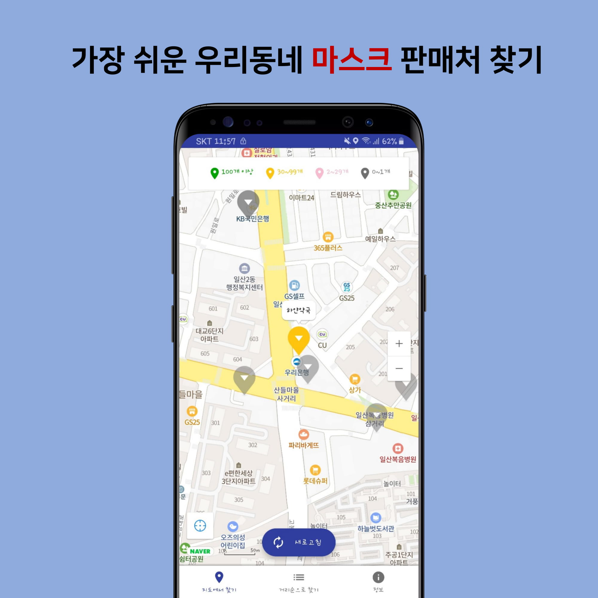
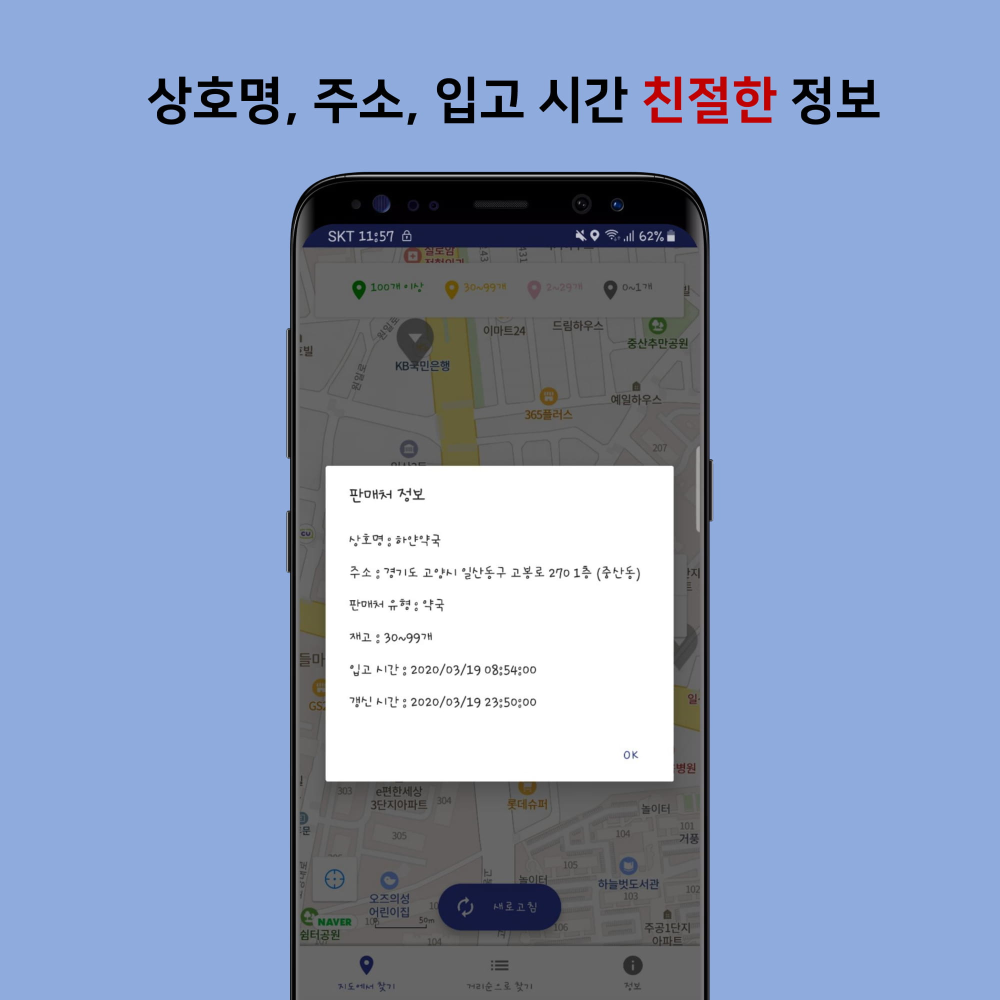
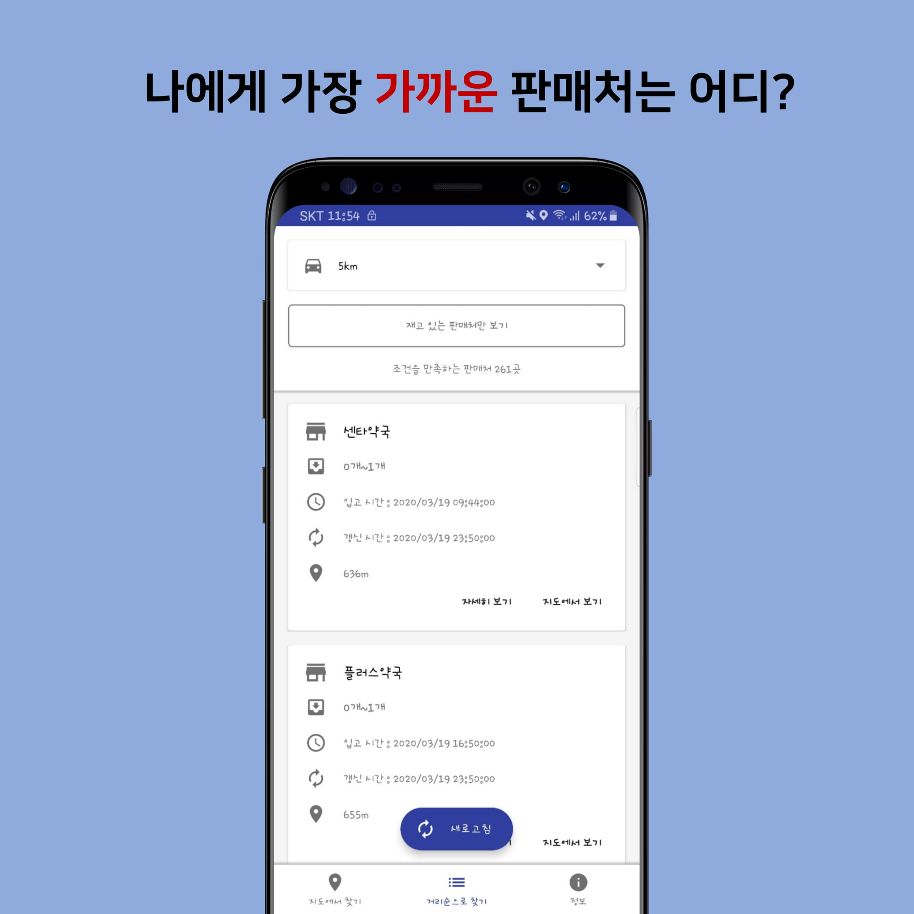

# 가장 쉬운 우리동네 공적 마스크 판매처 찾기 - 우리동네 마스크

COVID-19의 확산으로 부족해진 마스크를 보급하는 공적 마스크의 판매처를 찾고, 재고 현황을 조회할 수 있는 애플리케이션 입니다.

현재 공적 마스크 판매 종료로 인해 사용 불가능합니다.

 

## About Application

나의 위치를 기준으로 주변에 존재하는 공적 마스크 판매처의 재고 상태 등을 확인 할 수 있는 애플리케이션 입니다.

가장 쉬운 우리동네 공적 마스크 판매처 찾기 애플리케이션!

내 주변에 존재하는 공적 마스크 판매처의 재고 상태, 주소 등을 확인해보세요.

코로나19 의료진과 자원봉사자 여러분의 노고에 감사를 드립니다.

[다운로드 링크](https://m.onestore.co.kr/mobilepoc/apps/appsDetail.omp?prodId=0000746936)

## Screenshot

  

## API Information

- 지도 : NaverMap API
- 공적마스크 : 공공데이터포털 공적마스크 Open API
